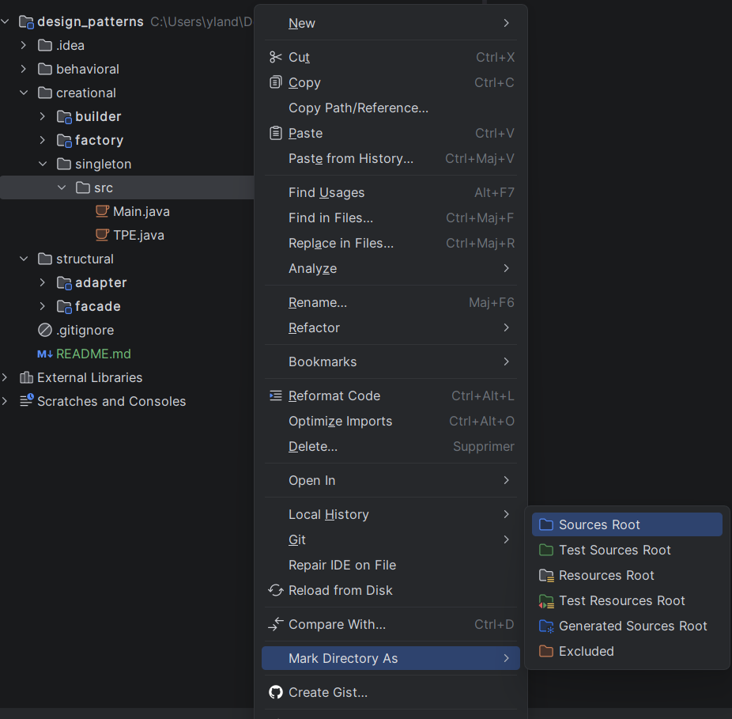

# Design Patterns

## Problem rencontrés lors du clone du dépôt
Si vous rencontrez un problème avec le module singleton lors du clone du dépôt suivez les étapes suivantes :
1. Déplier les fichiers du module singleton 
2. Faites clique droit sur le dossier src présent dans le dossier singleton
3. Cliquez sur "Mark Directory as" 
4. Cliquez sur "Sources Root"
Voici une image pour mieux comprendre les étapes à suivre :

Merci de votre compréhension !